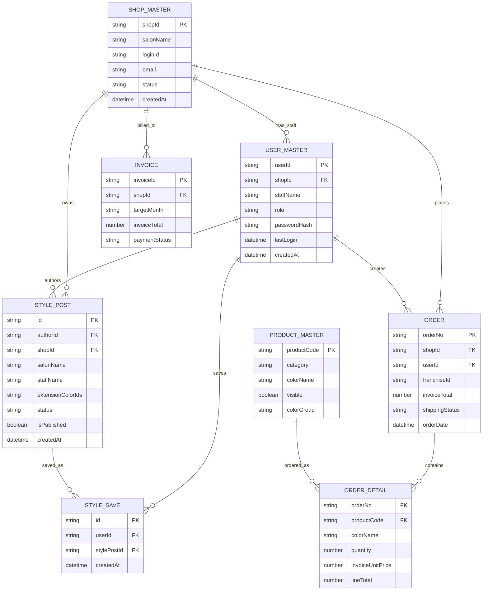

# Kimikea Connect Data Model

## ID policy

- `userId`: immutable user ID. Used for style posts, saved styles, sessions, profile ownership, and operation permissions.
- `shopId`: immutable shop ID. Used for orders, invoices, shop permissions, map/shop style filtering, and shop-level data.
- `loginId`: login identifier. Currently synchronized with email. Changing email updates `loginId` and email only; it must not change `userId` or `shopId`.

Display fields such as salon name, staff name, and email are not primary keys.

## Current ER diagram

## Spreadsheet mapping

Current production compatibility:

- `SHOP_MASTER` is represented by `加盟店マスタ`.
- `USER_MASTER` is represented by `ユーザーマスタ`.
- Existing `加盟店マスタ` rows still contain compatibility fields such as `memberId`, `userId`, `shopId`, `role`, and password columns.
- New setup/sync copies user fields into `ユーザーマスタ` so future multi-staff login can be added without changing historical shop data.

## Query rules

- My posts: `STYLE_POST.authorId == currentUser.userId`
- Saved styles: `STYLE_SAVE.userId == currentUser.userId`
- Shop styles: `STYLE_POST.shopId == selectedShopId`
- Orders: `ORDER.shopId == currentUser.shopId`, with legacy fallback to `加盟店ID`
- Invoices: `INVOICE.shopId == currentUser.shopId`
- Permissions: `userId`, `shopId`, and `role`

